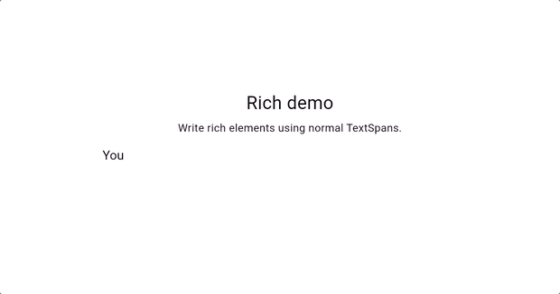
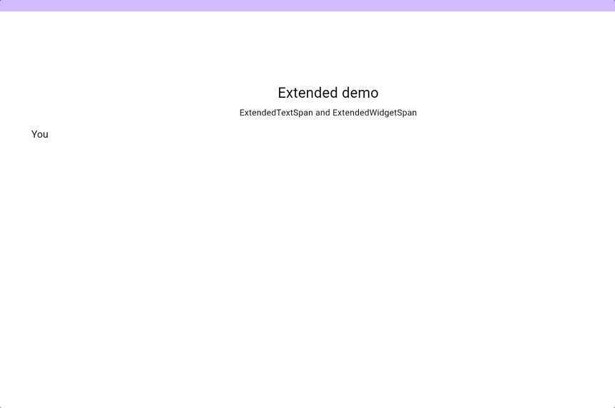

# RichTextWriter

Write text with `RichTextWriter`.

[Run the example](./example/lib/main.dart)

## Basic text:

The text is printed using the specified delimiter and duration.


```dart
RichTextWriter(
  '''
  Whether you're a brother or whether you're a mother
  You're stayin' alive, stayin' alive
  Feel the city breakin' and everybody shakin'
  And we're stayin' alive, stayin' alive
  Ah, ha, ha, ha, stayin' alive, stayin' alive
  Ah, ha, ha, ha, stayin' alive
  ''',
  duration: 25,
  delimiter: " ",
);
```

## Rich text:

Compose TextSpans together like you would in a `RichText`.



```dart
RichTextWriter.span(
  TextSpan(
    children: [
      const TextSpan(
        text: 'You can also compose the text with a ',
        style: TextStyle(
          color: Colors.black,
          fontSize: 14,
        ),
      ),
      const TextSpan(
        text: 'TextSpan',
        style: TextStyle(
          color: Colors.blue,
          fontSize: 14,
          fontWeight: FontWeight.bold,
        ),
      ),
      const TextSpan(
        text:
            "\nwhich let's you do all the normal rich features including widgets:\n",
        style: TextStyle(
          color: Colors.black,
          fontStyle: FontStyle.italic,
          fontSize: 14,
        ),
      ),
      WidgetSpan(
        child: Container(
          height: 40,
          width: 40,
          color: Colors.green,
        ),
      ),
      const TextSpan(text: " "),
      TextSpan(
          text: "and tappable text.",
          style: const TextStyle(
            color: Colors.blue,
            fontSize: 16,
            decoration: TextDecoration.underline,
          ),
          recognizer: TapGestureRecognizer()
            ..onTap = () {
              showDialog<String>(
                context: context,
                builder: (BuildContext context) => AlertDialog(
                  title: const Text('AlertDialog Title'),
                  content: const Text('AlertDialog description'),
                  actions: <Widget>[
                    TextButton(
                      onPressed: () => Navigator.pop(context, 'Cancel'),
                      child: const Text('Cancel'),
                    ),
                    TextButton(
                      onPressed: () => Navigator.pop(context, 'OK'),
                      child: const Text('OK'),
                    ),
                  ],
                ),
              );
            }),
    ],
  ),
  duration: 25,
  delimiter: " ",
);
```

## Extended text:

The `ExtendedTextSpan` and `ExtendedWidgetSpan` support custom text writing including
variable durations and start/complete handlers.



```dart
RichTextWriter.span(
  TextSpan(
    children: [
      const TextSpan(
        text: 'You can use an ',
        style: TextStyle(
          color: Colors.black,
          fontSize: 14,
        ),
      ),
      const TextSpan(
        text: 'ExtendedTextSpan',
        style: TextStyle(
          color: Colors.blue,
          fontSize: 14,
          fontWeight: FontWeight.bold,
        ),
      ),
      const TextSpan(
        text: " In place of a TextSpan to add additional behavior, like ",
        style: TextStyle(
          color: Colors.black,
          fontStyle: FontStyle.italic,
          fontSize: 14,
        ),
      ),
      ExtendedTextSpan(
        children: [
          ExtendedTextSpan(
            text: 'Variable text duration',
            duration: 300,
            style: const TextStyle(
              color: Colors.blue,
              fontWeight: FontWeight.bold,
              fontSize: 14,
            ),
          ),
          const TextSpan(text: ' and an '),
          ExtendedTextSpan(
            text: 'onComplete',
            style: const TextStyle(
              color: Colors.black,
              fontStyle: FontStyle.italic,
              fontSize: 14,
            ),
            duration: 100,
          ),
          const TextSpan(
            text:
                ' handler that should be making a dialog show up right about...',
          ),
          ExtendedTextSpan(
            text: 'Now',
            duration: 200,
            style: const TextStyle(
              color: Colors.black,
              fontWeight: FontWeight.bold,
              fontSize: 14,
            ),
          ),
        ],
        style: const TextStyle(
          color: Colors.black,
          fontSize: 14,
        ),
        onComplete: () {
          showDialog<String>(
            context: context,
            builder: (BuildContext context) => AlertDialog(
              title: const Text('AlertDialog Title'),
              content: const Text('AlertDialog description'),
              actions: <Widget>[
                TextButton(
                  onPressed: () => Navigator.pop(context, 'Cancel'),
                  child: const Text('Cancel'),
                ),
                TextButton(
                  onPressed: () => Navigator.pop(context, 'OK'),
                  child: const Text('OK'),
                ),
              ],
            ),
          );
        },
      ),
    ],
  ),
  duration: 25,
  delimiter: " ",
);
```

